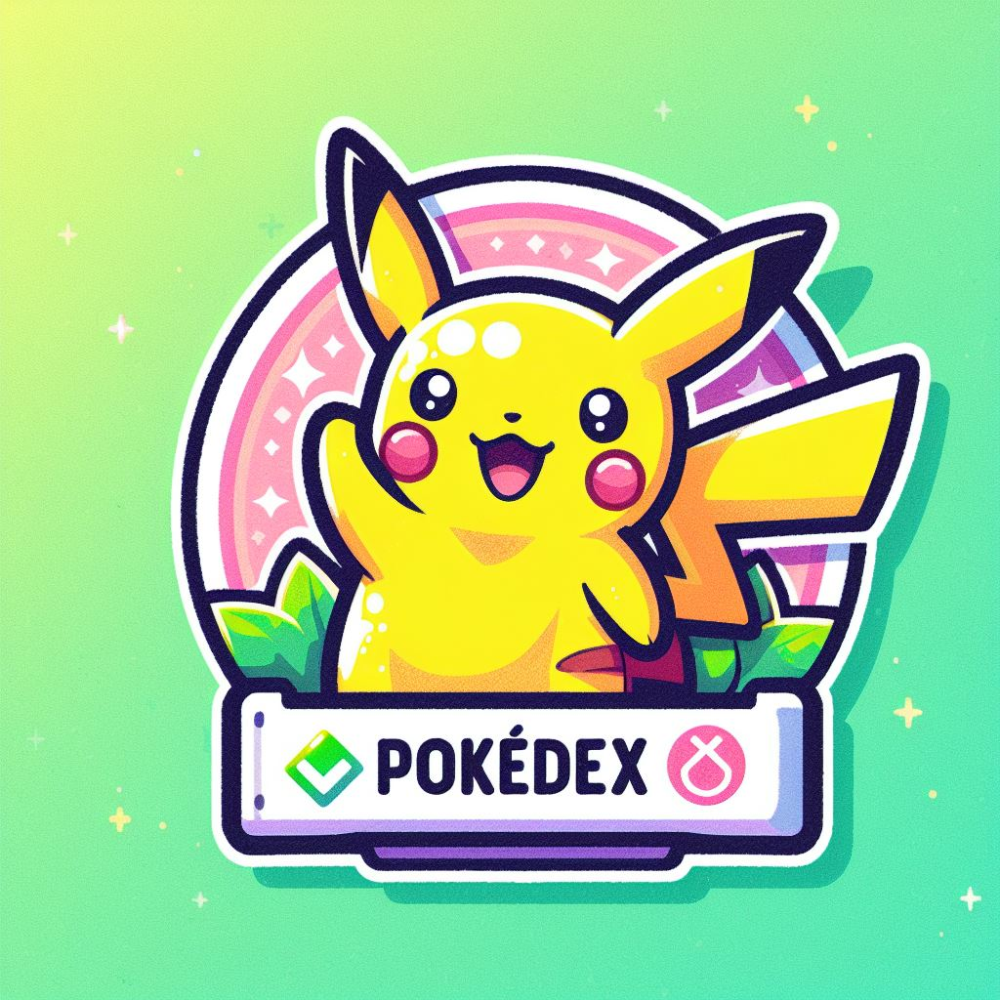

[![Forks][forks-shield]][forks-url]
[![Stargazers][stars-shield]][stars-url]
[![Issues][issues-shield]][issues-url]
[![LinkedIn][linkedin-shield]][linkedin-url]

<!-- PROJECT LOGO -->
 

  

<h3 align="center">Pokedex</h3>

  

    Pokedex from I to V generation of Pokemon, with footprints and cries of all pokemons!!
     
    <a href="https://github.com/kimjosell/pokedex"><strong>Explore the docs »</strong></a>
     
     
    <a href="https://kimjosell.github.io/pokedex/">View Demo</a>
    ·
    <a href="https://github.com/kimjosell/pokedex/issues">Report Bug</a>
    ·
    <a href="https://github.com/kimjosell/pokedex/issues">Request Feature</a>
  

<!-- TABLE OF CONTENTS -->

  
Table of Contents

  <ol>
    <li>
      <a href="#about-the-project">About The Project</a>
      <ul>
        <li><a href="#built-with">Built With</a></li>
      </ul>
    </li>
    <li>
      <a href="#getting-started">Getting Started</a>
      <ul>
        <li><a href="#prerequisites">Prerequisites</a></li>
        <li><a href="#installation">Installation</a></li>
      </ul>
    </li>
    <li><a href="#usage">Usage</a></li>
    <li><a href="#roadmap">Roadmap</a></li>
    <li><a href="#contributing">Contributing</a></li>
    <li><a href="#license">License</a></li>
    <li><a href="#contact">Contact</a></li>
    <li><a href="#acknowledgments">Acknowledgments</a></li>
  </ol>

<!-- ABOUT THE PROJECT -->
## About The Project

[![Product Name Screen Shot][product-screenshot]]("images/screenshot-preview.png")

I create this pokedex to show the information that sometimes I didn't find in others pokedex apps thanks to PokeAPI you can search pokemons from the first to the fifth generation
and hear its cry see its height and weight and so on.

(<a href="#readme-top">back to top</a>)

### Built With

* [![JavaScript][JavaScript]][JavaScript-url]
* [![CSS][CSS]][CSS-url]
* [![HTML][HTML]][HTML-url]

(<a href="#readme-top">back to top</a>)

<!-- GETTING STARTED -->
## Getting Started

Just open <a href="https://kimjosell.github.io/pokedex/">Pokedex APP</a> and search your favorite pokemon!!

(<a href="#readme-top">back to top</a>)

<!-- USAGE EXAMPLES -->
## Usage
With pokedex app you can search for your favorite pokemon from I Gen to V Gen
![search screenshot][search-pokedex-view]

Also you can compare the height and weight of the pokemons with a real person
![height screenshot][height-pokedex-view]

and finally you can hear the pokemons cries!!
![cry pokedex][cry-pokedex-view]

(<a href="#readme-top">back to top</a>)

## Contact

Your Name - [@kimjosell](https://twitter.com/kimjosell) - kimjosellag@gmail.com

Project Link: [https://github.com/kimjosell/pokedex](https://github.com/kimjosell/pokedex)

(<a href="#readme-top">back to top</a>)

<!-- ACKNOWLEDGMENTS -->
## Acknowledgments

* PokeAPI

(<a href="#readme-top">back to top</a>)

<!-- MARKDOWN LINKS & IMAGES -->
<!-- https://www.markdownguide.org/basic-syntax/#reference-style-links -->
[JavaScript]: https://img.shields.io/badge/JavaScript-F0DB4F?style=for-the-badge&logo=JavaScript&logoColor=323330
[JavaScript-url]: https://developer.mozilla.org/es/
[HTML]: https://img.shields.io/badge/HTML-F06529?style=for-the-badge&logo=HTML5&logoColor=white
[HTML-url]: https://developer.mozilla.org/es/
[CSS]: https://img.shields.io/badge/CSS-2965f1?style=for-the-badge&logo=CSS3&logoColor=white
[CSS-url]: https://developer.mozilla.org/es/
[contributors-shield]: https://img.shields.io/github/contributors/kimjosell/pokedex.svg?style=for-the-badge
[contributors-url]: https://github.com/kimjosell/pokedex/graphs/contributors
[forks-shield]: https://img.shields.io/github/forks/kimjosell/pokedex.svg?style=for-the-badge
[forks-url]: https://github.com/kimjosell/pokedex/network/members
[stars-shield]: https://img.shields.io/github/stars/kimjosell/pokedex.svg?style=for-the-badge
[stars-url]: https://github.com/kimjosell/pokedex/stargazers
[issues-shield]: https://img.shields.io/github/issues/kimjosell/pokedex.svg?style=for-the-badge
[issues-url]: https://github.com/kimjosell/pokedex/issues
[license-shield]: https://img.shields.io/github/license/kimjosell/pokedex.svg?style=for-the-badge
[license-url]: https://github.com/kimjosell/pokedex/blob/master/LICENSE.txt
[linkedin-shield]: https://img.shields.io/badge/-LinkedIn-black.svg?style=for-the-badge&logo=linkedin&colorB=555
[linkedin-url]: https://linkedin.com/in/kimjosell
[search-pokedex-view]: images/screenshots/search-pokemon-view.png
[view-pokedex-view]: images/screenshots/view-pokemon-view.png
[height-pokedex-view]: images/screenshots/height-pokedex-view.png
[weight-pokedex-view]: images/screenshots/weight-pokedex-view.png
[cry-pokedex-view]: images/screenshots/cry-pokedex-view.png
[product-screenshot]: images/screenshots/screenshot-preview.png
[Next.js]: https://img.shields.io/badge/next.js-000000?style=for-the-badge&logo=nextdotjs&logoColor=white
[Next-url]: https://nextjs.org/
[React.js]: https://img.shields.io/badge/React-20232A?style=for-the-badge&logo=react&logoColor=61DAFB
[React-url]: https://reactjs.org/
[Vue.js]: https://img.shields.io/badge/Vue.js-35495E?style=for-the-badge&logo=vuedotjs&logoColor=4FC08D
[Vue-url]: https://vuejs.org/
[Angular.io]: https://img.shields.io/badge/Angular-DD0031?style=for-the-badge&logo=angular&logoColor=white
[Angular-url]: https://angular.io/
[Svelte.dev]: https://img.shields.io/badge/Svelte-4A4A55?style=for-the-badge&logo=svelte&logoColor=FF3E00
[Svelte-url]: https://svelte.dev/
[Laravel.com]: https://img.shields.io/badge/Laravel-FF2D20?style=for-the-badge&logo=laravel&logoColor=white
[Laravel-url]: https://laravel.com
[Bootstrap.com]: https://img.shields.io/badge/Bootstrap-563D7C?style=for-the-badge&logo=bootstrap&logoColor=white
[Bootstrap-url]: https://getbootstrap.com
[JQuery.com]: https://img.shields.io/badge/jQuery-0769AD?style=for-the-badge&logo=jquery&logoColor=white
[JQuery-url]: https://jquery.com 
